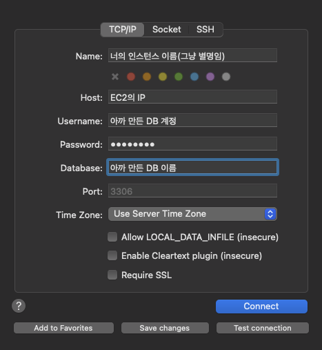
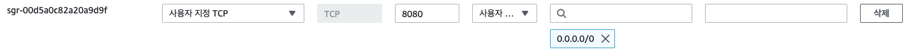

💻 AWS EC2
=============


###     ✔ [EC2 인스턴스 생성 및 실행](#📖-EC2-인스턴스-생성-및-실행)

### ✔ [탄력적 IP 설정](#📖-탄력적-ip-설정)

### **✔ [EC2 인스턴스 연결](#📖-EC2-인스턴스-연결)**

### **✔ [Sequal Ace로 접속하여 DB 넣어주기](#📖-sequal-ace로-접속하여-db-넣어주기)**

### **✔ [Project 배포하기](#📖-project-배포하기)**


## 📖 EC2 인스턴스 생성 및 실행

* ### **AWS 접속**

**아마존 AWS** - https://aws.amazon.com/ko/

접속 후 **로그인(회원가입)** 후 **EC2 대시보드** 접근

* ### **인스턴스 시작**


#### **OS 이미지**는 리눅스 계열에서 가장 사용하기 편하고 배우기 쉬운 **Ubuntu LTS 버전**을 선택한다.


#### **인스턴스 유형**은 **t2.micro 프리티어** 버전을 사용한다.


#### **키 페어**는 **새 키 페어 생성**으로 해당 인스턴스에 대한 키 페어를 만들어 준다. (만들어진 키 페어는 소중하게 간직)


#### **네트워크 설정**에서는 이미 해당 인스턴스를 위한 보안 그룹이 만들어져 있다면 "기존 보안 그룹 선택"을 선택한 뒤 보안 그룹을 선택해주고,

#### 그렇지 않다면 **"보안 그룹 생성"**을 선택하여 아래 **3가지에 대한 트래픽 허용을 모두 체크**한다. (SSH 트래픽의 경우 **내 IP**를 사용하는 것이 안전)


#### **스토리지 구성**은 프리 티어에서 사용할 수 있는 30GB 때려 박는다.(**추가 인스턴스를 사용하는 경우 30GB를 잘 쪼개서 사용하기 바람**)

#### 그리고 **인스턴스 시작**을 눌러준다.

---


## 📖 탄력적 IP 설정

#### 인스턴스를 재부팅하거나 중지 및 시작을 할 경우, 퍼블릭 IP가 유동적으로 바뀌어 번거로운 경우가 상당히 많기 때문에 미리 탄력적 IP를 설정해준다.

네트워크 및 보안 탭에서 **탄력적 IP**로 들어간다.

**탄력적 IP 주소 할당** 버튼을 눌러 탄력적 IP 주소 설정창으로 들어간다.

설정 없이 **할당** 버튼을 누른다. 

만들어진 탄력적 IP 주소에 **이름을 설정**해 주고 해당 **탄력적 IP 주소를 클릭**하여 상세창으로 들어간다.

재빨리 **탄력적 IP 주소 연결**을 눌러 들어가서 **본인이 사용할 인스턴스를 찾아 선택**해주고 해당 인스턴스의 **프라이빗 IP 주소를 선택**하고 연결한다. (인스턴스에 연결이 안되어 있으면 요금이 청구될 수 있음)

---


## 📖 EC2 인스턴스 연결


그대로 바로 연결을 클릭한다.

클릭해서 터미널로 접속하면 리눅스 설치하듯이 패키지 인스톨러 업데이트를 해준다. (mysql이랑 java도 설치)

```
sudo apt update
sudo apt install mysql-server						//mysql 설치
sudo apt install openjdk-본인자바버전-jdk	 //java 설치
```

mysql에 접속

```
sudo mysql
```

접속 후

```
ALTER USER 'root'@'localhost' identified with mysql_native_password by '새로운 비밀번호';
```

를 입력하여 root에 대한 비밀번호를 설정해준다.

root로 mysql을 접속한다.

```
sudo mysql -u root
//패스워드를 입력해준다.
```

접속 후 사용자 계정을 추가해준다.

```
create database DB이름;
create user '사용할 계정'@'%' identified by '사용할 비밀번호';
grant all on DB이름.* to '사용할 계정'@'%' with grant option;
flush privileges;
```

exit으로 기존의 root 계정에서 나온뒤 만든 계정으로 접속한다.

```
mysql -u 사용할 계정 -p
//만들 때 입력했던 패스워드 입력
```

그럼 이제 만든 DB를 확인할 수 있다.

---


## 📖 Sequal Ace로 접속하여 DB 넣어주기


사용하는 보안 그룹에 **MYSQL/Aurora 유형의 포트를 열어주고** 당연히 내 IP로 하는게 안전하다.

터미널에서 **root 계정으로 전환**한 뒤, **/etc/mysql 폴더로 이동**하여 mysqld.cnf 파일을 찾는다.

찾은 경로를 **vim을 통해 수정**한다.

```
sudo -i			//root 계정으로 전환
cd /etc/mysql		//etc/mysql 폴더로 이동
grep -r "bind" ./		//경로를 파악
vim mysql.conf.d/mysqld.cnf		//vim을 통해 수정
```

**insert 모드**로 접근하여 **bind-address / mysql-bind-address 를 주석**처리 해준다.

:wq로 insert모드를 종료하고 나와서 재부팅 한번 해준다.

```
sudo systemctl restart mysql
```

이제 Sequal Ace로 접속할 차례다.



위같이 입력 후 Connect를 클릭하면 정상 접속할 수 있을 것이다.

이렇게 접속하면 껍데기만 있게 되는데, 본래 Local에서 사용하던 DB도 Sequal Ace로 열어서 고대로 만든 DB에 옮겨준다.

---


## 📖 Project 배포하기

우선 보안 그룹에 인바운드 규칙하나를 추가해준다.



Spring의 기본 포트가 8080으로 설정되어 있기 때문에 해당 포트를 열어준다.

로컬 터미널로 프로젝트의 jar파일을 만들어준다.

```
//배포할 프로젝트 폴더에 접근
chmod +X gradlew
./gradlew bootjar
//build/libs에 jar 파일 생성됨
```

그 다음 **EC2 서버로 jar 파일**을 보낼 것이다.

이는 **SSH 클라이언트** 연결로 **로컬 터미널로 접속**하여 사용해야 한다. (인스턴스 연결할 때 SSH 클라이언트 탭을 클릭하면 연결방법은 잘 설명되어 있음. 아마 아까 저장했던 작고 소중한 **키 페어가 필요**할거임)

로컬 터미널로 접속한 후 **jar 파일을 받을 폴더**를 하나 만들어준다.

```
mkdir version		//EC2 서버에 version 폴더 안에 저장할거임
```

SSH 접속을 끊고 나와서

```
scp -i [키 페어 파일 경로] [보낼 파일 경로] [사용자계정]@[EC2 주소]:[받는 위치]
```

위처럼 하면 파일이 보내질 것이다.

다시 인스턴스에 접속해서

```
cd version		//version 폴더로 이동
nohup java -jar -Dspring.profiles.active=[사용할 프로파일] [version에 옮긴 파일이름] &		//무중단 배포
```

**nohup을 통해 무중단으로 배포**한다.

```
cat nohup.cat		//로그 보기
jobs		//현재 백그라운드에서 돌아가는 파일 확인
fg %(인덱스)		//인덱스에 해당하는 프로그램 가져오기
```

위의 커맨드로 서버를 컨트롤하면 된다. (가져온 프로그램은 ctrl+c로 종료 가능)

***

위 자료는 2023/07/13에 작성되었습니다. (추후 변경 가능)

+ **참고 자료**
  https://velog.io/@jonghyun3668/SpringBoot-%ED%94%84%EB%A1%9C%EC%A0%9D%ED%8A%B8-EC2-%EB%B0%B0%ED%8F%AC%ED%95%98%EA%B8%B0

  https://blogshine.tistory.com/321

  https://seong6496.tistory.com/322

  
