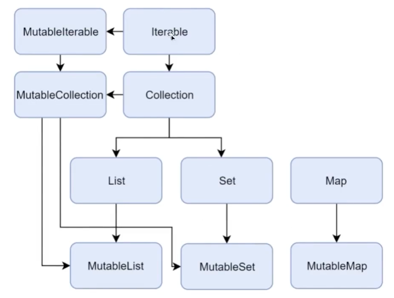

💻 코틀린 FP
=============


## 📖 배열

사실 배열은 잘 안씀. (Effective Java에서도 '배열보다는 리스트를 사용하라'라고 함)

그치만 일단 배워보자

+ ### Java에서의 배열

```java
int[] array = {100, 200};
for (int i = 0; i < array.length; i++) {
    System.out.printf("%s %s", i, array[i]);
}
```

+ ### Kotlin에서의 배열

```kotlin
val array = arrayOf(100, 200)
//array 안을 돌리기
for (i in array.indices) {
    println("${i} ${array[i]}")
}
//index와 같이 뽑기
for ((idx, value) in array.withIndex()) {
    println("${idx} ${value}")
}
```

> + ##### <span style="color:yellowgreen">배열.indices</span> : 0부터 마지막 index까지의 범위
>
> + ##### <span style="color:yellowgreen">배열.withIndex()</span> : indices와 같지만 인덱스와 값을 한 번에 가져올 수 있음

***

## 📖 Kotlin에서의 Collection - List / Set / Map

+ ### Kotlin의 Collection 계층구조



> + #### 불변 컬렉션 : Collection에 element를 추가, 삭제할 수 없음
>
>   + ###### Collection을 만들자마자 Collections.unmodifiableList()  등을 붙여줌
>
> + #### <span style="color:yellow">가변(Mutable)</span> 컬렉션 : Collection에 element를 추가, 삭제할 수 있음

### <span style="color:tomato">Kotlin은 무조건 불변/가변을 지정해 주어야함!!</span>

### Collection - List

+ ##### Java의 List

```java
final List<Integer> numbers = Arrays.asList(100, 200);
```

+ ##### Kotlin의 List

```kotlin
val numbers = listOf(100, 200)
val mutableNumbers = mutableListOf(100, 200)
val emptyList = emptyList<Int>()	//빈 리스트 만들기 - 타입을 명시해줌
println(numbers[0])		//element 가져오기
mutableNumbers.add(300) 	//가변 리스트에 element 추가하기
```

> + <span style="color:yellowgreen">listOf()</span>를 통해 불변리스트를 만들어 줄 수 있음
> + 빈 List를 만들 경우 타입을 명시해 주어야 함
> + 일반 배열처럼 ''배열.get()' 외에도 <span style="color:yellowgreen">'리스트[idx]'</span>로 element를 가져올 수 있음

> + <span style="color:yellowgreen">mutableListOf()</span>를 통해 가변리스트를 만들어 줄 수 있음
> + ArrayList가 기본 구현체임
> + <span style="color:yellowgreen">'리스트.add(요소)'</span>로 element를 추가해줄 수 있음

##### 간단한 TIP 우선 불변리스트를 만들고, 꼭 필요한 경우 가변 리스트로 바꾸자!!

### Collection - Set

+ List와 다르게 순서가 없고, 같은 element 하나만 존재할 수  있음 (List와 대부분 비슷)

```kotlin
val numbers = setOf(100, 200)
val mutableSet = mutableSetOf(100,200)
val emptySet = emptySet<Int>()		//빈 리스트 만들기 - 타입을 명시해줌
mutableSet.add(300)		//가변집합에 element 추가하기
```

> + <span style="color:yellowgreen">setOf()</span>를 통해 불변집합을 만들어 줄 수 있음
> + 빈 Set을 만들 경우 타입을 명시해 주어야 함

> + <span style="color:yellowgreen">mutableListOf()</span>를 통해 가변리스트를 만들어 줄 수 있음
> + LinkedHashSet이 기본 구현체임
> + <span style="color:yellowgreen">'집합.add(요소)'</span>로 element를 추가해줄 수 있음

### Collection - Map

+ ##### Java의 Map

```java
//JDK 8까지
Map<Integer, String> map = new HashMap<>();
map.put(1, "MONDAY");
map.put(2, "TUESDAY");

//JDK 9부터
Map.of(1, "MONDAY", 2, "TUESDAY"); //(Key1, Value1, Key2, Value2)
```

+ ##### Kotlin의 Map

```kotlin
//Java처럼 쓰기
val oldMap = mutableMapOf<Int, String>()
oldMap.put(1,"MONDAY")

//Kotlin 답게 쓰기
val map = mutableMapOf<Int, String>()		//타입추론이 되지 않아 타입을 명시해줌
map[1] = "MONDAY"
map[2] = "TUESDAY"

mapOf(1 to "MONDAY", 2 to "TUESDAY")    //중위 호출로 넣기
```

> + Kotlin도 동일하게 MutableMap을 만들어 넣을 수도 있고, 정적 팩토리 메소드를 활용할 수도 있음
> + <span style="color:yellowgreen">'map[key] = value'</span>를 써서 element를 넣을 수 있음

```kotlin
//key를 통해 접근
for (key in map.keys) {
    println(key)
    println(oldMap[key])
}

//객체를 가져와서 접근
for ((key, value) in map.entries) {
    println(key)
    println(value) 
}
```

다음과 같이 활용 가능함

***

## 📖 컬렉션의 null 가능성 / Java와 함께 사용하기

+ ### List<Int?>

  + List에 null이 들어갈 수는 있지만, List는 절대 null이 아님

+ #### List<Int>?

  + List에 null이 들어갈 수 없지만, List는 null일 수 있음

+ ### List<Int?>?

  + List에 null이 들어갈 수도 있고, List가 null일 수도 있음

### '?' 위치에 따라 null 가능성 의미가 달라지므로 조심해야됨

Java는 읽기 전용 컬렉션과 변경 가능 컬렉션을 구분하지 않음

Java는 nullable 타입과 non-nullable 타입을 구분하지 않음

#### 	> 다음과 같은 문제는 Java <-> Kotlin 간의 오작동을 일으킬 수 있음

​	따라서 Kotlin 쪽의 컬렉션이 Java에서 호출되면 컬렉션 내용이 변할 수 있음을 감안해야함

​	Kotlin 쪽에서 <span style="color:yellowgreen">'Collections.unmodifiableXXX()'</span> 활용하면 변경 자체를 막을 수 있음

​	Java 코드를 보며 맥락을 확인하고 Java 코드를 가져오는 지점을 wrapping 해서 영향 범위를 최소화해야함 

***

## 📖 확장함수

 Kotlin은 기본적으로 Java와 100% 호환하는 것을 목표로 함

기존 Java위에 자연스럽게 Kotlin 코드를 추가할 수는 없을까?

##### 함수의 코드 자체는 클래스 밖에 있지만, 마치 클래스 안에 있는 멤버함수처럼 호출해서 사용 ( = 확장함수)

```kotlin
//String 클래스를 확장하는 확장함수
fun String.lastChar(): Char {
    return this[this.length - 1]	//this를 이용해 실제 클래스 안의 값에 접근
}
```

+ <span style="color:yellowgreen">'fun 확장하려는 클래스.함수이름(파라미터):리턴타입{}'</span>과 같은 형식으로 만들 수 있음
+ <span style="color:yellowgreen">'this'</span>를 통해서 실제 클래스 안의 값에 접근 가능 (수신 객체 )
+ 확장함수는 클래스에 있는 private/protected 멤버를 가져올 수 없음 (캡슐화가 깨지는 것처럼 보여짐)
+ 확장함수와 멤버함수의 시그니처가 같다면,<span style="color:yellow"> 멤버함수가 우선적으로</span> 호출됨
+ 확장함수 오버라이딩이 일어난 경우엔 해당 변수의 <span style="color:yellow">현재 타입에 따라</span> 어떤 확장함수가 호출될지 결정됨

```kotlin
open class Train(
    val name: String = "새마을 기차",
    val price: Int = 5_000
)

fun Train.isExpensive(): Boolean {
    println("Train의 확장함수")
    return this.price>=10000
}

class Srt:Train("SRT", 40_000)

fun Srt.isExpensive(): Boolean {
    println("SRT의 확장함수")
    return this.price>=10000
}

fun test() {
    val train: Train = Train()
    train.isExpensive() //Train의 확장함수 호출됨
    val srt1: Train = Srt()
    srt1.isExpensive()  //Train의 확장함수 호출됨
    val srt2: Srt = Srt()
    srt2.isExpensive()  //SRT의 확장함수 호출됨
}
```

+ 확장함수 + Custom Getter를 써서 <span style="color:yellow">확장 프로퍼티</span>를 만드는 것도 가능

```kotlin
//String 클래스를 확장하는 확장프로퍼티
val String.lastChar:Char
    get() = this[this.length - 1]
```


***

## 📖 infix 함수

#### 함수를 호출하는 새로운 방법임 (ex. downTo, step)

원래는 '변수.함수이름(argument)'로 호출하지만 중위함수의 경우엔 <span style="color:yellowgreen">'변수 함수이름 argument'</span>로 호출함

```kotlin
//일반함수
fun Int.add(other: Int): Int {
    return this + other
}
//중위함수
infix fun Int.add2(other: Int): Int {
    return this + other
}

    3.add(4)        //일반 확장함수
    3.add2(4)       //Infix 함수 (일반함수처럼 사용가능)
    3 add2 4            //Infix 함수
```

+ 중위함수는 일반함수처럼도 사용이 가능함
+ 예시에는 확장함수에 붙여 사용했지만 당연히 일반함수에도 붙여서 사용할 수 있음

***

## 📖 inline 함수

함수가 호출되는 대신, 함수를 호출한 지점에 함수 본문을 그대로 복붙하고 싶은 경우 사용함

함수를 파라미터로 전달할 때에 오버헤드를 줄일 수 있지만, inlin함수의 사용은 성능측정과 함께 신중해야함

***

## 📖 지역함수

함수안에 함수로 코드가 중복되는 경우 함수안에 함수를 만들어 코드를 간결화 할 수 있음

함수로 추출하면 좋을 것 같은데, 해당 함수를 지금 함수 내에서만 사용하고 싶을 경우 사용함

```kotlin
fun createPerson(firstName: String, lastName: String): Person {
    //지역함수
    fun validateName(name: String, fieldName: String) {
        if (name.isEmpty()) {
            throw IllegalArgumentException("${fieldName}은 비어있을 수 없습니다. 현재 값 : ${name}")
        }
    }
    validateName(firstName, "firstName")
    validateName(lastName, "lastName")

    return Person(firstName, lastName, 1)
}
```

하지만 depth가 깊어지기도 하고 코드가 생각보다 깔끔하지는 않음 (위같은 경우도 그냥 Person 클래스에서 검증하는게 나을듯)

***

## 📖 Java에서의 람다

+ ### 이번 챕터에서 함께할 JavaFruit 클래스

```java
public class JavaFruit {
    private final String name;
    private final int price;

    public JavaFruit(String name, int price) {
        this.name = name;
        this.price = price;
    }

    public String getName() {
        return name;
    }

    public int getPrice() {
        return price;
    }
}
```

```java
List<JavaFruit> fruits = Arrays.asList(
        new JavaFruit("사과", 1_000),
        new JavaFruit("사과", 1_200),
        new JavaFruit("사과", 1_200),
        new JavaFruit("사과", 1_500),
        new JavaFruit("바나나", 3_000),
        new JavaFruit("바나나", 3_200),
        new JavaFruit("바나나", 2_500),
        new JavaFruit("수박", 1_000)
        );
```

여기서 사과를 찾을 때, 다음과 같은 함수를 쓸 수 있음

```java
//사과 찾기
private List<JavaFruit> findApples(List<JavaFruit> fruits) {
    List<JavaFruit> apples = new ArrayList<>();
    for (JavaFruit fruit : fruits) {
        if (fruit.getName().equals("사과")) {
            apples.add(fruit);
        }
    }
    return apples;
}
```

근데 만약 또 바나나를 찾는다? 그럼 이렇게 만들어야됨

```java
//바나나 찾기
private List<JavaFruit> findBananas(List<JavaFruit> fruits) {
    List<JavaFruit> bananas = new ArrayList<>();
    for (JavaFruit fruit : fruits) {
        if (fruit.getName().equals("바나나")) {
            bananas.add(fruit);
        }
    }
    return bananas;
}
```

위에 두 코드는 중복이니까 당연히 다음과 같이 중복을 제거하여 해결가능

```java
//원하는 과일 이름으로 찾기
private List<JavaFruit> findFruitsWithName(List<JavaFruit> fruits, String name) {
    List<JavaFruit> results = new ArrayList<>();
    for (JavaFruit fruit : fruits) {
        if(fruit.getName().equals(name)){
            results.add(fruit);
        }
    }
    return results;
}
```

근데 만약 위 같은 경우 외에 더 많은 요구사항이 생기면 어떻게 할까?

단순히 파라미터를 늘리는 것으로는 어림도 없음

따라서 <span style="color:yellow">인터페이스</span>와 <span style="color:yellow">익명클래스</span>를 활용하기로 함

```java
//인터페이스
public interface FruitFilter {
    boolean isSelected(JavaFruit fruit);
}
```

```java
//메소드 생성
private List<JavaFruit> filterFruits(List<JavaFruit> fruits, FruitFilter fruitFilter) {
    List<JavaFruit> results = new ArrayList<>();
    for (JavaFruit fruit : fruits) {
        if (fruitFilter.isSelected(fruit)) {
            results.add(fruit);
        }
    }
    return results;
}
```

```java
//익명클래스 활용
filterFruits(fruits, new FruitFilter(){
    @Override
    public boolean isSelected(JavaFruit fruit) {
        return Arrays.asList("사과", "바나나").contains(fruit.getName())
                && fruit.getPrice() > 5_000;
    }
});
```

위와 같이 해결할 수는 있지만

+ 익명클래스를 활용하는 방법이 복잡함
+ 다양한 Filter가 필요할 수 있음

#### 따라서 JDK8부터 <span style="color:yellow">람다(이름 없는 함수)</span>가 등장함

#### 또한 Predicate, Consumer같은 Filter 인터페이스 등을 많이 만들어 두었음

위의 코드를 다음과 같이 해결함

```java
//메소드 생성 - Predicate 인터페이스로 대체
private List<JavaFruit> filterFruits(List<JavaFruit> fruits, Predicate<JavaFruit> fruitFilter) {
    List<JavaFruit> results = new ArrayList<>();
    for (JavaFruit fruit : fruits) {
        if (fruitFilter.test(fruit)) {
            results.add(fruit);
        }
    }
    return results;
}
```

```java
//익명클래스 활용 - 람다식을 통해 간결해짐
filterFruits(fruits, fruit -> fruit.getName().equals("사과"));
```

+ ##### <span style="color:yellowgreen">'변수 -> 변수를 이용한 함수'</span>

+ ##### <span style="color:yellowgreen">'(변수1, 변수2) -> 변수1과 변수2를 이용한 함수'</span>

이같은 형식으로 람다식을 작성 가능

```java
 private List<JavaFruit> filterFruits(List<JavaFruit> fruits, Predicate<JavaFruit> fruitFilter) {
    return fruits.stream()		//Stream
             .filter(fruitFilter)		//필터
             .collect(Collectors.toList());		//리스트로 반환
 }
```

<span style="color:yellow">Stream</span>을 통해 더욱 더 간결한 병렬처리가 가능해짐

```java
filterFruits(fruits, JavaFruit::isApple);
```

<span style="color:yellow">메소드 레퍼런스</span>를 통해 또한번 람다식도 줄일 수 있음

이처럼 Java에서는 메소드 자체를 직접 넘겨주는 것처럼 쓸 수 있는데,

##### Java에서 함수는 변수에 할당되거나 파라미터로 전달할 수 없음을 의미함 (함수를 <span style="color:yellow">2급 시민</span>으로 간주)

***

## 📖 Kotlin에서의 람다

Kotlin에서의 함수는 Java와 근본적으로 다른점이 한가지가 있음

### Kotlin에서는 함수가 그 자체로 값이 될 수 있고, 변수에 할당할 수도, 파라미터로 넘길 수도 있음

+ Kotlin에서의 람다 활용

```kotlin
//람다를 만드는 방법1 - 이름만 빠짐
//(Fruit)를 받아 Boolean을 반환하는 타입
val isAppleV1: (Fruit) -> Boolean = fun(fruit: Fruit): Boolean {
    return fruit.name == "사과"
}
```

```kotlin
//람다를 만드는 방법2 - 중괄호가 화살표 사용하기
//(Fruit)를 받아 Boolean을 반환하는 타입
val isAppleV2: (Fruit) -> Boolean = { fruit: Fruit -> fruit.name == "사과" }
```

```kotlin
//람다를 호출하는 방법1 - 그냥 소괄호로 호출
isAppleV1(fruits[0])
//람다를 호출하는 방법2 - invoke를 사용해 호출
isAppleV1.invoke(fruits[0])
```

##### 이 때 각 함수는 타입을 가지는데 <span style="color:yellowgreen">'(타입)을 입력받아 (타입)을 반환하는 타입'</span>이라고 할 수 있음

+ Java에서의 Filter를 Kotlin 버전으로 바꾼다면

```kotlin
private fun filterFruits(
    fruits: List<Fruit>, filter: (Fruit) -> Boolean
): List<Fruit> {
    val results = mutableListOf<Fruit>()
    for (fruit in fruits) {
        if (filter(fruit)) {
            results.add(fruit)
        }
    }
    return results
}
```

```kotlin
    filterFruits(fruits, isAppleV1)
    filterFruits(fruits, { fruit: Fruit -> fruit.name == "사과" })
    filterFruits(fruits) { fruit: Fruit -> fruit.name == "사과" }	//마지막 파라미터가 함수인 경우 소괄호 밖에 람다 사용 가능
    filterFruits(fruits) { fruit -> fruit.name == "사과" }
    filterFruits(fruits) { it.name == "사과" }
```

위와 같은 변화를 통해 filter를 호출하는 형태도 간결하게 줄일 수가 있음

##### 이처럼 Kotlin에서는 함수를 <span style="color:yellow">1급 시민</span>으로 간주하기 때문에 함수를 활용한 코드가 간결해질 수 있음

***

## 📖 Closure

```java
String targetFruitName = "바나나";
targetFruitName = "수박";
filterFruits(fruit, (fruit) -> targetFruitName.equals(fruit.getName()));
```

Java에서 다음과 같은 코드를 사용할 수 없음 (람다식에서 람다식 밖에 있는 변수를 사용하는데에 제약이 걸림, final만 쓸 수 있음)

```kotlin
var targetFruitName = "바나나"
targetFruitName = "수박"
filterFruits(fruits) { it.name == targetFruitName }
```

#### 하지만 Kotlin에서는 가능함

##### Kotlin에서는 람다가 시작하는 지점에 참조하고 있는 변수들을 <span style="color:yellow">모두 포획</span>하여 그 정보를 가지고 있음

##### 이게 가능해야만 람다를 진정한 1급 시민으로 간주할 수 있음 (해당 데이터 구조를 <span style="color:yellow">Closure</span>이라고 부름)

***

## 📖 Filter&Map

+ ### Filter

```kotlin
val apples = fruits.filter{fruit->fruit.name=="사과"}		//이름이 사과인 애들 뽑기
```

##### <span style="color:yellowgreen">'컬렉션.filter{(컬렉션에 있는 요소)->Boolean}'</span>형식으로 사용하여 저장됨

```kotlin
val applesIdx = fruits.filterIndexed(){ idx, fruit ->
    println(idx)
    fruit.name == "사과"
}		//이름이 사과인 애들 뽑기 + 인덱스 사용
```

##### <span style="color:yellowgreen">'컬렉션.filterIndexed{idx, (컬렉션에 있는 요소)->Boolean}'</span>형식으로 인덱스도 가져올 수 있음

+ ### Map

```kotlin
//사과인 애들의 현재 가격을 뽑기
val applePrice = fruits.filter{it.name=="사과"}.map { it.currentPrice }
```

##### <span style="color:yellowgreen">'컬렉션.map{(컬렉션에 있는 요소)->원하는 요소}'</span>형식으로 해당 요소들만 뽑아볼 수 있음

```kotlin
val applePriceIndex = fruits.filter{ it.name = "사과"}.mapIndexed{ idx, fruit ->
    println(idx)
    fruit.currentPrice
}		//사과인 애들의 현재 가격을 뽑기 + 인덱스 사용
```

##### <span style="color:yellowgreen">'컬렉션.map{idx, (컬렉션에 있는 요소)->원하는 요소}'</span>형식으로 인덱스도 가져올 수 있음

```kotlin
val appleNull = fruits.filter{it.name=="사과"}.mapNotNull{fruit: Fruit -> fruit.nullOrValue() }		//사과인 애들의 nullOrValue()에 해당하는 값 중 null이 아닌 것만 뽑기
```

##### <span style="color:yellowgreen">'컬렉션.mapNotNull{(컬렉션에 있는 요소)->원하는 요소}'</span>형식으로 해당 요소들 중 null이 아닌 것만 뽑아볼 수 있음

***

## 📖 다양한 Collection 처리 기능

+ ### all

```kotlin
val isAppleAll = fruits.all{ it.name == "사과"}		//컬렉션 안의 모든 name이 사과면 true
```

##### <span style="color:yellowgreen">'컬렉션.all{(컬렉션에 있는 요소)->Boolean}'</span>형식으로 컬렉션을 조사해서 모두 해당할 경우 true, 아니면 false

+ ### None

```kotlin
val isAppleNone = fruits.none{ it.name == "사과"}		//컬렉션 안의 모든 name이 사과가 아니면 true
```

##### <span style="color:yellowgreen">'컬렉션.none{(컬렉션에 있는 요소)->Boolean}'</span>형식으로 컬렉션을 조사해서 모두 해당할 경우 true, 아니면 false

+ ### Any

```kotlin
val isAppleAny = fruits.any{ it.name == "사과"}		//컬렉션 안의 name 중 하나라도 사과면 true
```

##### <span style="color:yellowgreen">'컬렉션.any{(컬렉션에 있는 요소)->Boolean}'</span>형식으로 컬렉션을 조사해서 하나라도 해당하면 true

+ ### Count

```kotlin
val fruitCount = fruits.count()     //컬렉션의 사이즈
```

##### <span style="color:yellowgreen">'컬렉션.count'</span>형식으로 컬렉션의 사이즈를 구함

+ ### SortedBy(Decending)

```kotlin
val fruitCountSortedBy = fruits.sortedBy{ it.currentPrice }     //현재가를 오름차순으로 정렬 저장
```

##### <span style="color:yellowgreen">'컬렉션.sortedBy{(컬렉션에 있는 요소)->원하는 요소}'</span>형식으로 오름차순 정렬 후 저장

+ ### DistinctBy

```kotlin
val fruitDistinctBy = fruits.distinctBy{it.name}    //같은 이름인 애들 중복 제거
```

##### <span style="color:yellowgreen">'컬렉션.destinctBy{(컬렉션에 있는 요소)->Boolean}'</span>형식으로 컬렉션 요소를 탐색해 중복 제거

+ ### First / FirstOrNull / Last / LastOrNull

```kotlin
val fruitFirst = fruits.first()     //첫번째 요소를 가져옴(null이면 안됨)
val fruitFirstOrNull = fruits.firstOrNull() //첫번째 요소를 가져옴
val fruitLast = fruits.last()       //마지막 요소를 가져옴(null이면 안됨)
val fruitLastOrNull = fruits.lastOrNull()   //마지막 요소를 가져옴
```

***

## 📖 List to Map

+ ### 과일이름 -> List<과일>

```kotlin
//Key: 과일이름 / Value: 리스트<과일>
val map: Map<String, List<Fruit>> =fruits.groupBy{ it.name }
```

##### <span style="color:yellowgreen">'컬렉션.groupBy'</span>를 사용

+ ### Id -> 과일

```kotlin
//Key: ID / Value: 과일
val mapAssociate: Map<String, Fruit> = fruits.associateBy { it.id } 
```

##### <span style="color:yellowgreen">'컬렉션.associateBy'</span>를 사용

+ ### 과일이름 -> 출고가

```kotlin
//Key: 과일이름 / Value: 출고가
val mapGroup2: Map<String, List<Unit>> = fruits.groupBy({ it.name }, { it.factoryPrice })
```

##### <span style="color:yellowgreen">'컬렉션.groupBy'</span>를 사용

+ ### Id -> 출고가

```kotlin
//Key: ID / Value: 출고가
val mapAssociate2 = fruits.associateBy({it.id}, {it.factoryPrice})
```

##### <span style="color:yellowgreen">'컬렉션.associateBy'</span>를 사용


***

## 📖 중첩된 Collection 처리

+ ### FlatMap

중첩되어 있는 Collection에 람다를 두번 걸어주어 해당 조건에 만족하는 리스트로 뽑아줌

+ ### Flatten

중첩되어 있는 Collection을 그냥 풀어서 하나의 리스트로 뽑아줌

***

+ 수강한 강의 - 자바 개발자를 위한 코틀린 입문(Java to Kotlin Starter Guide), 최태현 from 인프런
  <https://www.inflearn.com/course/java-to-kotlin/dashboard>