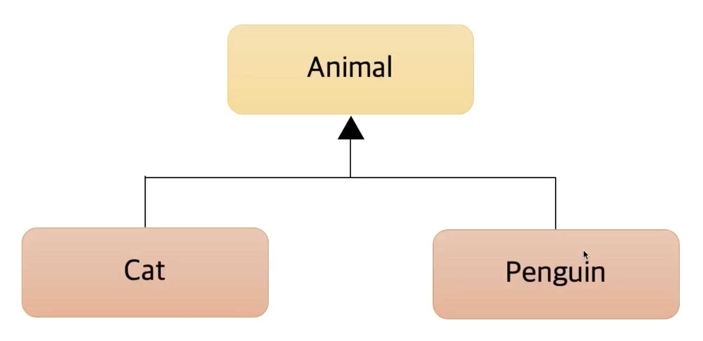
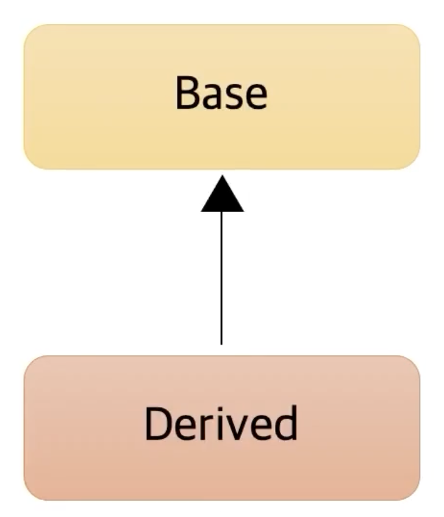

💻 코틀린 OOP
=============
</br>

📖 클래스와 프로퍼티
-------------

> ### 개명이 불가능한 Person 클래스가 있을때, 
>
>   > ### Java의 경우
> ```java
>     public class JavaPerson {
> 
>     //Java의 필드
>     private final String name;
>     private int age;
> 
>     //Java의 생성자
>     public JavaPerson(String name, int age) {
>         this.name = name;
>         this.age = age;
>     }
> 
>     //Java의 Getter
>     public String getName() {
>         return name;
>     }
>     public int getAge() {
>         return age;
>     }
> 
>     //Java의 Setter
>     public void setAge(int age) {
>         this.age = age;
>     }
> }
> ```
>   > ### Kotlin의 경우
> ```kotlin
> class Person constructor(name: String, age: Int) {
>           //constructor는 생략가능
>     val name = name
>     var age = age
> }
> ```
> ## __프로퍼티__ = 필드 + Getter + Setter
> 코틀린에서는 필드(프로퍼티)만 만들면 나머지는 자동으로 만들어줌
>
> + 클래스의 필드와 생성자를 __동시에 선언__ 할 수 있음
> ```kotlin
> class Person (
>     val name: String,
>     var age: Int
> ) 
> 코틀린에서는 필드(프로퍼티)만 만들면 나머지는 자동으로 만들어줌
>
> + 클래스의 필드와 생성자를 __동시에 선언__ 할 수 있음
> ```kotlin
> class Person (
>     val name: String,
>     var age: Int
> ) 
> ```
>
> + __'.필드'__ 를 통해 Getter/Setter를 바로 호출한다
> ```kotlin
>   val person = Person("Luke", 10)
>   println(person.name)    //Getter
>   println(person.age)     //Getter
>   person.age = 10         //Setter
> ```

> 초기값을 지정해주지 않으면 에러 발생

***
</br>

📖 생성자와 init
-------------

> ### 클래스가 생성되는 시점에 나이를 검증해보기
>
>   > ### Java의 경우
> ```java
>     public class JavaPerson {
>       ...
>     //Java의 생성자
>     public JavaPerson(String name, int age) {
>         //Java의 검증로직
>         if (age <= 0) {
>             throw new IllegalArgumentException(String.format("나이(%s)는 1이상 이어야 합니다.", age));
>         }
>         this.name = name;
>         this.age = age;
>     }
>       ...
> }
> ```
>   > ### Kotlin의 경우
> ```kotlin
> class Person(
>     val name: String,
>     var age: Int
> ) {
>     //Kotlin의 검증로직
>     init {
>         if (age <= 0) {
>             throw IllegalArgumentException("나이${age}는 1이상 이어야 합니다.")
>         }
>     }
> }
> ```
>
> ### init
>
> * 값을 적절히 만들어주거나, 검증하는 로직을 넣는 용도로 사용
> * 생성자가 호출되는 시점에 생성됨

> ### 부생성자 만들어보기
>
>   > ### Java의 경우
> ```java
>    public class JavaPerson {
>       ...
>       //Java의 나이가 1인 생성자 (부생성자)
>       public JavaPerson(String name) {
>           this(name, 1);
>       }
>       ...
>    }
> ```
>   > ### Kotlin의 경우
> ```kotlin
>    class Person(...){
>       ...
>       //Kotlin의 나이가 1인 생성자 (부생성자)
>       constructor(name: String) : this(name, 1){
>           println("부생성자1")    //다음과 같이 생성자 블록에 바디를 작성할 수 있음
>       }
>       //Kotlin의 이름이 홍길동인 생성자
>       constructor() : this("홍길동"){
>           println("부생성자2")
>       }
>       ...
>    }
> ```
> * __'constructor(파라미터)'__ 로 생성자를 추가
> * __'this(파라미터)'__ 로 위에 있는 생성자를 호출
> * constructor(생성자) 블록에 바디를 작성할 수 있음
> ### __주생성자__ 는 반드시 있어야 하며, 파라미터는 없을 수 있음
> ### __부생성자__ 는 있을 수도 있고, 없을 수도 있음
</br>

> 다음과 같은 코드에서 __두 번째 부생성자를 실행__ 할 경우,
> ```kotlin
>       class Person(
>           val name: String,
>           var age: Int,
>       ) {
>           init {
>               if (age <= 0) {
>                   throw IllegalArgumentException("나이${age}는 1이상 이어야 합니다.")
>               }
>               println("초기화")
>           }
>           constructor(name: String) : this(name, 1){
>               println("부생성자1")    //다음과 같이 생성자 블록에 바디를 작성할 수 있음
>           }
>           constructor() : this("홍길동"){
>               println("부생성자2")
>           }
>       }
> ```
> ### 출력값: __초기화 -> 부생성자1 -> 부생성자2__
> 역순으로 호출됨

</br>

> ### 근데 코틀린에서는 부생성자를 잘 안씀 (__Default Parameter__ 로 대체)
> ```kotlin
>       class Person(
>           val name: String = "홍길동",    //Default
>           var age: Int = 1,   //Default
>       ) {
>           init {
>               if (age <= 0) {
>                   throw IllegalArgumentException("나이${age}는 1이상 이어야 합니다.")
>               }
>               println("초기화")
>           }
>       }
> ```
> ### Converting처럼 객체의 변경이 일어날때는 써야하지만 거의 없음


***
</br>

📖 커스텀 Getter / Setter & Backing field
-------------

> ### 성인인지 확인하는 기능
>
>   > ### Java의 경우
> ```java
>    public class JavaPerson {
>       ...
>       //Java의 성인인지 확인하는 기능
>       public boolean isAdult() {
>           return this.age >= 20;
>       }
>       ...
>    }
> ```
>   > ### Kotlin의 경우
> ```kotlin
>    class Person(...){
>       ...
>        //Kotlin의 성인인지 확인하는 기능
>        fun isAdultV1(): Boolean = this.age >= 20
>
>        //밑에 두 개가 Custom Getter
>        val isAdultV2: Boolean
>            get() = this.age >= 20
>
>        val isAdultV3: Boolean
>            get() {
>                return this.age >= 20
>            }
>       ...
>    }
> ```
> Expression을 통해 Getter를 Custom

> ### 자기 자신도 변형 가능
> ```kotlin
>    class Person(
>       name: String,
>       var age:Int
>    ){
>       ...
>       val name:String = name
>           get() = field.uppercase()
>       ...
>    }
> ```
> field가 아닌 name을 쓰면 호출이 무한루프를 돌게 됨
>
> 따라서 자기 자신을 호출하는 경우에는 __'field'__ 를 사용
>
> 이것을 __Backing field__ 라고 부름

> ### name을 set할때 무조건 대문자로 바꾸기
> ```kotlin
>   var name: String = name
>       set(value){
>           field = value.uppercase()
>       }
> ```
> 사실 __Setter 자체를 지양__ 하기 때문에 Custom Setter도 잘 안씀

***
</br>

📖 추상 클래스
-------------

> ### 다음과 같이 추상 클래스를 구성할거임

</img>

> ### Animal 추상 클래스
>   * Java의 추상 클래스
> ```java
> public abstract class JavaAnimal {
> 
>     protected final String species;
>     protected final int legCount;
> 
>     public JavaAnimal(String species, int legCount) {
>         this.species = species;
>         this.legCount = legCount;
>     }
> 
>     //추상 메소드
>     abstract public void move();
> 
>     //Getter
>     public String getSpecies() {
>         return species;
>     }
>     public int getLegCount() {
>         return legCount;
>     }
> }
> ```
>   * Kotlin의 추상 클래스
> ```kotlin
> abstract class Animal(
>     //Getter/Setter 자동 생성
>     //상속받은 자식클래스에서 Getter를 재정의 하기위해 open 붙임
>     protected val species: String,
>     protected open val legCount: Int, //오버라이드할 때 open
> ) {
>     //추상 메소드
>     abstract fun move()
> }
> ```

> ### Cat 상속 클래스
>   * Java의 상속 클래스
> ```java
> public class JavaCat extends JavaAnimal {
> 
>     //생성자 상속
>     public JavaCat(String species) {
>         super(species, 4);
>     }
> 
>     //상속받은 메소드 재정의
>     @Override
>     public void move() {
>         System.out.println("JavaCat Move");
>     }
> }
> ```
>   * Kotlin의 상속 클래스
> ```kotlin
> class Cat(
>     //생성자 상속
>     species: String
> ) : Animal(species, 4) {
> 
>     //상속받은 메소드 재정의
>     override fun move() {   //어노테이션 없이 override를 붙여 씀
>         println("Cat Move")
>     }
> }
> ```
> - extends 대신에 __':'__ 을 써서 상속받음
> - 상위 클래스의 생성자를 바로 호출해야함

> ### Penguin 상속 클래스
>   * Java의 상속 클래스
> ```java
> public final class JavaPenguin extends JavaAnimal {
>
>     //상속받은 클래스 속 새로운 필드
>     private final int wingCount;
> 
>     //생성자 상속
>     public JavaPenguin(String species) {
>         super(species, 2);
>         this.wingCount = 2;
>     }
> 
>     //상속받은 추상 메소드 재정의
>     @Override
>     public void move() {
>         System.out.println("Penguin Move");
>     }
> 
>     //부모 메소드 상속받아 재정의
>     @Override
>     public int getLegCount() {
>         return super.getLegCount() + this.wingCount;
>     }
> }
> ```
>   * Kotlin의 상속 클래스
> ```kotlin
> class Penguin(
>     //생성자 상속
>     species: String,
>     //상속받은 클래스 속 새로운 필드
>     private val wingCount: Int = 2
> ) : Animal(species, 2){
> 
>     //상속받은 추상 메소드 재정의
>     override fun move() {
>         println("Penguin Move")
>     }
> 
>     //부모 프로퍼티 상속받아 Getter 재정의
>     override val legCount:Int
>         get() = super.legCount + this.wingCount> 
> }
> ```
> ### __중요!!__ 프로퍼티를 오버라이드 할때는 부모 클래스에서 __open__ 으로 열어줘야함 

> * ### 상위 클래스에 접근할 때는 Java, Kotlin 모두 super를 사용함
> * ### Java, Kotlin 모두 추상 클래스를 인스터스화 할수 없음

***
</br>

📖 인터페이스
-------------

> ### 다음과 같이 인터페이스를 구성할거임

</img>

> ### Flyable, Swimmable 인터페이스
>   * Java의 인터페이스
> ```java
> public interface JavaFlyable {
> 
>     default void act() {
>         //default 바디
>         System.out.println("Flying");
>     }
> }
> ```
> ```java
> public interface JavaSwimable {
> 
>     default void act() {
>         //default 바디
>         System.out.println("Swimming");
>     }
> }
> ```

>   * Kotlin의 인터페이스
> ```kotlin
> interface Flyable {
>     
>     //default 없이 메소드 구현 가능
>     fun act() = println("Flying")
> }
> ```
> ```kotlin
> interface Swimable {
> 
>     //Kotlin은 인터페이스에 프로퍼티도 구현가능
>     val swimAbility: Int
>         get() = 3 // => default값
> 
>     //default 없이 메소드 구현 가능
>     fun act() = println("Swimming ")
> }
> ```
> ### Kotlin의 인터페이스는 Default 키워드 없이 메소드 구현 가능

> ### Penguin 구현체
>   * Java의 구현체
> ```java
> public final class JavaPenguin extends JavaAnimal implements JavaFlyable, JavaSwimable {
>     ...
>     //인터페이스 구현
>     @Override
>     public void act() {
>         JavaSwimable.super.act();
>         JavaFlyable.super.act();
>     }
> }
> ```
>   * Kotlin의 구현체
> ```kotlin
> class Penguin(...) : Animal(species, 2),
> Flyable, Swimable{
>     ...
>     //인터페이스 구현
>     override fun act() {
>         super<Swimable>.act()
>         super<Flyable>.act()
>     }
>     //프로퍼티 재정의
>     override val swimAbility: Int
>         get() = 5
> }
> ```
> * ### 상속과 같이 상속받는 클래스를 이어서 적어줌으로써 상속 가능
> * ### 중복되는 인터페이스를 특정할때 __'super<타입>.함수'__ 사용
> * ### Java, Kotlin 모두 인터페이스를 인스터스화 할 수 없음
> * ### Kotlin에서는 __Backing Field__ 가 없는 프로퍼티를 인터페이스에 만들 수 있음

***
</br>

📖 클래스를 상속할 때 주의할 점
-------------


</img>

```kotlin
open class Base(
    open val number: Int = 100
){
    init {
        println("Base Class")
        println(number)
    }
}
```
```kotlin
class Derived(
    override val number: Int
) : Base(number) {
    init {
        println("Derived Class")
    }
}
```

> ### 클래스가 다음과 같이 구성될 때,
```kotlin
Derived(300)
```
> ### 다음과 같이 인스턴스화 하면?
> ### __Base Class -> 0 -> Derived Class__ 같은 순서로 출력됨

> Derived에 있는 number에 값을 집어 넣어 줄 때
>
> 상위 클래스에서 number를 호출하게 되면 하위 클래스에 있는 number를 가져오게 되고
>
> 근데 아직 상위 클래스의 constructor가 먼저 실행된 단계이기 때문에 
>
> 하위 클래스 number의 초기화가 이루어지지 않은 상태임
>
> 따라서 0이 출력됨

> ### __상위 클래스의 constructor와 init 블럭에서는 하위 클래스의 필드에 접근하면 안됨__
> 고로 상위클래스를 설계할 때 생성자 또는 초기화 블록에 사용되는 프로퍼티에는 __'open'을 피해야 함__


***
</br>

📖 상속 관련 지시어 정리
-------------
> * ### final : override를 할 수 없게 함 (Default)
> * ### open : override를 열어 줌
> * ### abstract : 반드시 override 해야함
> * ### override : 상위 타입을 오버라이드 하고 있음

***
</br>


* 수강한 강의 - 자바 개발자를 위한 코틀린 입문(Java to Kotlin Starter Guide), 최태현 from 인프런
<https://www.inflearn.com/course/java-to-kotlin/dashboard>
